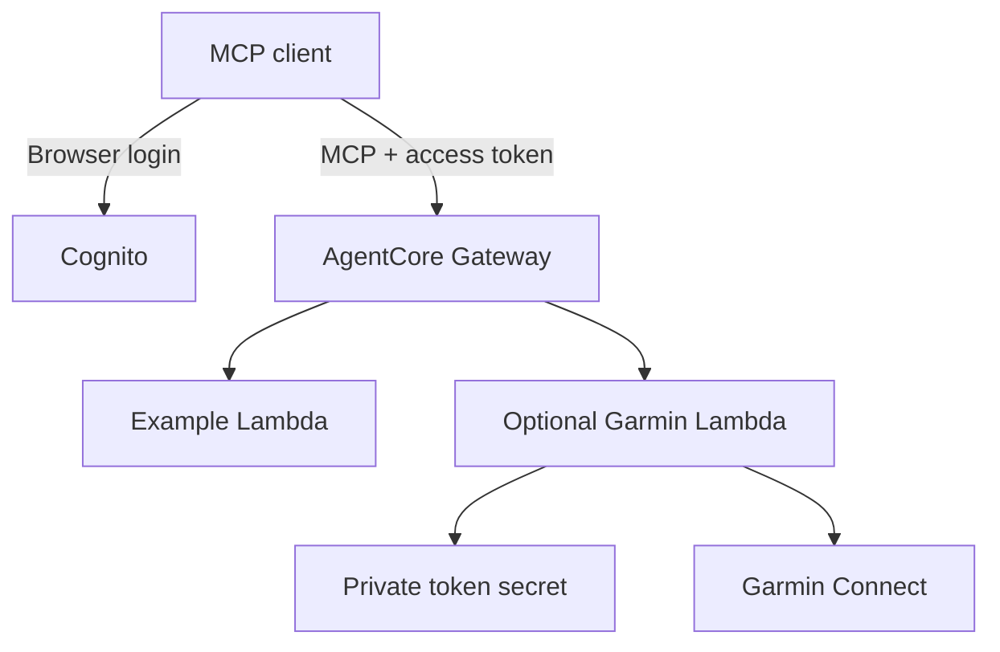

# MCP Serverless Kit

Deploy a modular personal MCP endpoint on AWS using **Amazon Bedrock AgentCore Gateway and AWS Lambda**. Fork the repository, enable modules, and deploy from GitHub Actions using short-lived AWS credentials.

**Status: development preview.** The Python modules and packaging have local tests. AWS deployment, Terraform provider validation, and browser OAuth flows with ChatGPT/Claude still need live verification. In particular, Cognito discovery may omit the PKCE metadata some clients require. The included preflight detects that problem; an AWS endpoint alone is not evidence of client compatibility.

## What you get

- One JWT-authenticated AgentCore Gateway exposing the enabled tools through MCP.
- One Python 3.12 Lambda per module; no always-running application server.
- Cognito authorization-code login, an admin-created owner, and exact callback allowlists.
- Terraform infrastructure, a private S3 state bootstrap, and GitHub Actions OIDC deployment.
- An accountless `example` module and an optional read-only `garmin` module.
- Dependency hashes, schema validation, OAuth discovery checks, and a destroy workflow.

This kit exposes **MCP tools**. AgentCore translates tool calls into Lambda invocations. It does not run an arbitrary stdio MCP server unchanged or expose that server's prompts/resources.



## Start in the browser

1. Fork this repository and run **Actions → Show AWS OIDC subject** on `main`.
2. Open AWS CloudShell as your IAM user/role, clone your fork, and run the guided bootstrap. It creates the deployment role and private state bucket.
3. Add the printed repository variables, then run **Deploy AWS MCP → plan**, followed by **apply**.
4. Create your owner login in CloudShell, add the exact client callback, and complete the client connection.

The detailed [browser-only setup](docs/setup.md) covers each screen and command. No local editor, access keys in GitHub, or always-on PC is required. AWS bootstrap privileges and an MCP-capable client account are prerequisites.

## Modules

The enabled list lives in `config/modules.json`:

```json
{"enabled": ["example"]}
```

| Module | Tools | External setup |
| --- | --- | --- |
| `example` | `echo`, `add` | None |
| `garmin` | `daily_stats`, `sleep`, `activities` | Personal Garmin login and a token secret |

Gateway tool names are prefixed, for example `example___echo`. [Add a module](docs/modules.md) by providing a manifest, handler, and hash-locked dependencies, then enabling it. Infrastructure discovers enabled modules automatically.

[Garmin setup](docs/garmin.md) is optional. Its code uses the unofficial `garminconnect` library; this is not a Garmin Health API partnership. It is a small independent adapter, not a deployment of the entire upstream Garmin MCP server.

## Costs and access

Standard Gateway pricing is $0.005 per 1,000 operations at the documented rate; 10,000 operations would be $0.05 **for Gateway alone**. Lambda, Cognito, S3, logs, network transfer and optional Secrets Manager have separate pricing. An enabled Garmin secret has a published storage price of about $0.40/month before API calls. See [costs](docs/costs.md) for assumptions and official sources.

There is no NAT gateway, container registry, provisioned concurrency, Bedrock model inference, semantic tool search, or AgentCore Memory in the default infrastructure. A Lambda concurrency reservation, if enabled, limits simultaneous invocations; it does not provision paid capacity.

This is a **single-owner deployment**: authorized users see the same enabled tools and Garmin account. Read the [security notes](docs/security.md) before inviting other users or extending permissions. A public source repository does not make the deployed endpoint's data public.

## Verification and removal

```bash
python -m pip install pytest==8.3.5 jsonschema==4.23.0
python -m pytest -q
python scripts/build.py
terraform -chdir=infra init -backend=false -lockfile=readonly
terraform -chdir=infra validate
```

After deployment, `scripts/preflight.py` checks the actual OAuth discovery and unauthenticated rejection. It cannot replace testing browser login, token refresh, `tools/list` and `tools/call` from each target client. See [verification](docs/verification.md).

Run **Deploy AWS MCP → destroy** to remove the Terraform deployment. The bootstrap state bucket is deliberately retained, and a Garmin secret has a deletion recovery window. [Cleanup instructions](docs/setup.md#remove-the-deployment) explain those remaining resources.

MIT licensed. Contributions that improve the reproducible setup or add independently testable modules are welcome.
