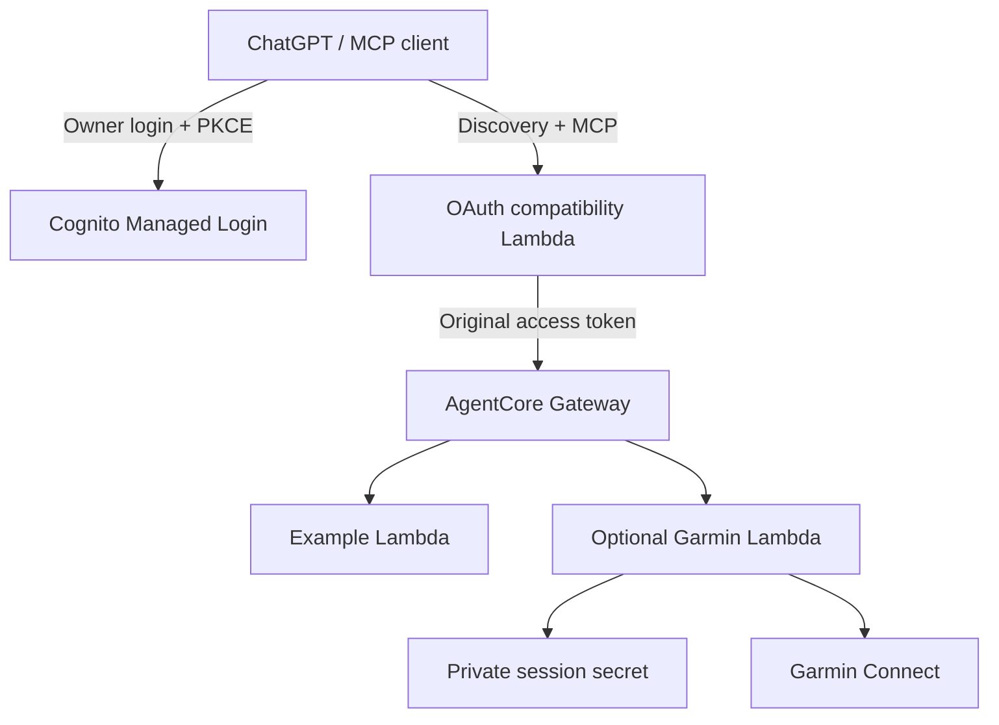

# MCP Serverless Kit

Deploy a personal, modular MCP server on AWS and connect it to ChatGPT. Give this repository to a coding agent: this README is its installation runbook, from an empty AWS account to a real authenticated tool call.

The kit uses **Amazon Bedrock AgentCore Gateway, Lambda, Cognito, S3 and GitHub Actions OIDC**. The browser-only route needs no always-running server, local Terraform installation or AWS access keys in GitHub. AWS CloudShell handles the operations requiring an AWS administrator or a hidden password prompt.

**Verified baseline, 2026-10-09:** deployment and metadata checks passed in `eu-south-1`; CI passed 94 tests; the owner reported a working ChatGPT connection and tools after the resource-bound scope migration. Refresh after token expiry, Claude, real Garmin access and full teardown are separate checks and remain unverified. See [verification evidence](docs/verification.md).

## Give this prompt to your coding agent

Copy this prompt with the repository URL, or use it in an agent that has this checkout:

```text
Set up this MCP Serverless Kit for me using README.md as the runbook.
Inspect the current repository and my available GitHub/AWS access first.
Use the defaults: personal-mcp, main, eu-south-1, example module, GitHub
Actions deployment, Cognito and a ChatGPT custom MCP app.
Reuse an existing installation if one exists; do not create duplicates.

Do everything your tools and my authorization allow. For actions I must
perform, give me one concrete screen or one fully substituted command block
at a time. Resolve all identifiers from actual outputs. Do not ask me to
invent role ARNs, OAuth endpoints, scopes, bucket names or IAM policies.
Wait for each stage's success evidence before proceeding. When I say "done",
verify the result where possible instead of assuming success.

Guide me through AWS account creation and administrator access if needed.
I enter passwords, payment information, verification codes and MFA myself.
Never ask me to paste these or OAuth tokens into chat, files or GitHub.
Use authorized temporary credentials or CloudShell, not root or long-lived
access keys, for infrastructure operations.

Before creating the ChatGPT app, obtain its actual callback URL, register it
through the repository variable and deploy, and verify the exact resource-
bound scope. Keep the creation form available while updating the callback.

Finish only after real echo and add calls succeed. Report refresh as pending
until tested. Diagnose failures with safe logs and this runbook; do not weaken
JWT validation, PKCE or callback allowlists. Retain non-secret setup identifiers
and results so we can resume later. Enable optional modules only after the
example works.
```

The agent can handle the technical reasoning. Account ownership, payment/terms acceptance, password entry, MFA and some client UI actions still require the user. Repository access does not automatically grant AWS access or access to the user's ChatGPT settings.

## Installation map

| Stage | Operator | Evidence required before proceeding |
| --- | --- | --- |
| 1. Repository and client | Agent; user for authentication | Writable repository, Actions enabled, custom MCP creation available |
| 2. AWS account/admin | User with agent guidance | Activated account and non-root administrator |
| 3. Region/identity | Agent or CloudShell | Intended account, Milan enabled, non-root caller |
| 4. OIDC subject | Agent or GitHub UI | Actual main-branch subject from workflow summary |
| 5. Bootstrap | CloudShell administrator | Complete CloudFormation stack and recorded outputs |
| 6. Deploy | Agent or GitHub UI | CI, reviewed plan, apply and preflight succeed |
| 7. Cognito owner | User in interactive CloudShell | `Owner login configured` |
| 8. ChatGPT app | Agent where supported; user for UI/login | Exact callback registered, scope correct, login and discovery succeed |
| 9. Tool/refresh checks | Connected client | Real echo and sum; refresh status recorded separately |

## Instructions for the coding agent

Read this README before changing configuration. Inspect `bootstrap/github-oidc.yaml`, `.github/workflows/`, `infra/`, `scripts/` and `config/modules.json` to confirm current behavior. Prefer connectors/APIs for supported operations; use the browser or a user-run command when the required operation is unavailable. Follow your environment's permissions and credential-entry rules.

- Gather only missing context: repository access, existing AWS account, authorized administrator session, client access and genuine user constraints. Use the defaults for implementation choices.
- Check existing stacks, repository variables and deployment runs before creating resources. On resume, read stack outputs and the latest successful apply summary.
- Give executable commands with real identifiers substituted. `YOUR-...` values below tell **the agent** to resolve an identifier; they are not a task for the user to design it. Never execute an unresolved placeholder.
- Use one account, region, project, state bucket and state key throughout. Retain non-secret identifiers in session notes outside tracked source. Reconstruct them from AWS/GitHub if notes are lost.
- Before deploying changed code, pass CI/tests/build/schema checks using pinned dependencies and the committed provider lockfile. Never bypass checksum verification.
- Prepare necessary fixes before requesting any approval your environment requires. A failed deployment is evidence to diagnose, not permission to broaden IAM arbitrarily.
- Keep credentials out of source, shell arguments, chat and workflow logs. Do not enable raw request/header/token logging. Never publish Terraform state/plan files.
- Distinguish infrastructure deployed, OAuth accepted, login complete, tools discovered and tools successfully called. A green apply does not prove client compatibility.
- Give one actionable step and its expected result at a time. Inspect a failure before retrying or asking for another user action.

### Defaults and recorded values

| Identifier | Default or authoritative source |
| --- | --- |
| Repository | User's writable fork; derive actual owner/name |
| Branch | `main` |
| Project | `personal-mcp` |
| Region | `eu-south-1` (Europe/Milan), enable first if needed |
| Modules | `{"enabled": ["example"]}` |
| Bootstrap stack | `personal-mcp-bootstrap` |
| Terraform state key | `terraform.tfstate` |
| GitHub subject | **Show AWS OIDC subject** summary, never guessed |
| Deploy role/state bucket | Bootstrap outputs |
| MCP URL, OAuth client/scope/pool | Successful apply's **MCP connection details** |
| ChatGPT callback | Actual URL displayed by the creation form |

Scripts have different fallback regions: bootstrap defaults to `eu-west-1`, Terraform to `us-east-1`. **Always pass the chosen region explicitly.** This runbook uses `eu-south-1` in AWS commands. If another supported region is required, the agent replaces it consistently in all commands and variables, including bootstrap updates and logs.

## 1. Prepare GitHub and check client access

1. Sign in to GitHub and fork this repository into the user's account, or reuse an existing writable copy. Retain the repository name unless a constraint requires changing it.
2. Open the fork's **Actions** tab and enable workflows if asked. Work on `main`; deploy and diagnostics jobs intentionally reject other branches.
3. Confirm **Validate**, **Show AWS OIDC subject**, **Deploy AWS MCP** and **MCP diagnostics** are listed. If missing, check `.github/workflows/` exists on the default branch.
4. Confirm the user's ChatGPT account/workspace offers custom MCP creation and developer mode where required. Follow [current OpenAI setup](https://help.openai.com/en/articles/12584461-developer-mode-and-full-mcp-connectors-in-chatgpt): labels, plan and workspace permissions can change. An unavailable client feature cannot be fixed with AWS IAM.
5. Keep only `example` enabled for the first installation. Defer Garmin credentials and SmartThings integration.

A fork or ordinary push creates no AWS resources. `Validate` uses no AWS credentials; deployment is a manually dispatched workflow.

**Checkpoint:** fork URL recorded, workflows present, custom MCP creation available before provisioning AWS for that client.

## 2. Create or reuse an AWS account and administrator

Skip account creation if an activated account and authorized non-root administrator exist. In an organization-managed account, use its assigned administrative role and policies rather than creating parallel access.

### New account

Use [AWS's account creation guide](https://docs.aws.amazon.com/accounts/latest/reference/getting-started.html) and its official signup link. The user completes email verification, root password, contact/billing details, identity verification, agreement acceptance and support selection. Wait for account activation before provisioning.

If Free and Paid account plans are offered, the agent explains restrictions and costs from [AWS's plan comparison](https://docs.aws.amazon.com/awsaccountbilling/latest/aboutv2/free-tier-plans.html). Paid provides full service access and can incur usage charges; this kit does not promise a free deployment. The user approves the plan. Choose Basic/no paid support add-on when available unless requested otherwise. Do not silently upgrade an account or join AWS Organizations to bypass a Free plan restriction.

### Root protection and non-root access

Use root only for initial account tasks. Enable root MFA and keep recovery information privately in the user's password manager. Never create root access keys or bootstrap as root. [AWS account setup](https://docs.aws.amazon.com/IAM/latest/UserGuide/getting-started-account-iam.html) recommends federated access through IAM Identity Center; reuse that access if configured. An organization's administrator should provide an approved administrative session.

For a new **standalone personal account without federation**, this explicit console-only bootstrap-user route avoids local access keys:

1. Open **IAM → Users → Create user**. Name it `mcp-bootstrap-admin`.
2. Enable **Provide user access to the AWS Management Console**. If the UI offers a choice, select the IAM-user route for this standalone setup.
3. The user sets/receives the password privately and completes any required password change. Save the IAM sign-in URL and username privately.
4. Attach the AWS-managed **AdministratorAccess** policy for human bootstrap administration. This is broad account control, **not** the policy attached to GitHub. An existing organization may require its custom administrative role instead.
5. Create the user and configure MFA under **Security credentials**. Sign out of root and sign in with the new IAM identity.
6. Open CloudShell and verify the caller in stage 3. Do not create an access key for this route.

The agent guides current screens using [IAM user creation instructions](https://docs.aws.amazon.com/IAM/latest/UserGuide/id_users_create.html). After installation, arrange ongoing administrative access according to account policy. Do not remove the only working non-root administrator until an alternative is verified: bootstrap maintenance and owner recovery still need an administrator.

| Identity | Purpose | Credential destination |
| --- | --- | --- |
| AWS root/admin | Own and administer AWS | AWS sign-in and private password manager |
| Cognito MCP owner | Sign in when ChatGPT connects | Cognito login and private password manager |
| Garmin owner, optional | Read Garmin data | Interactive helper; session tokens in Secrets Manager |

The GitHub OIDC role has no password. The OAuth client has no client secret. Neither is the Cognito owner's password.

### Cost visibility

Have the user inspect Billing and Cost Management, available credits and a cost budget/alert appropriate to their account. A budget notification is not a hard spending cap. Use [cost assumptions](docs/costs.md) and current AWS prices; Gateway, Lambda, Cognito, S3, logs and optional Secrets Manager are billed separately. Do not promise a zero bill.

**Checkpoint:** activated account, user-controlled MFA and working non-root administrator. An ordinary standalone AWS CLI command cannot complete new standalone account signup.

## 3. Enable Milan and verify the account

`eu-south-1` supports AgentCore Gateway and is this kit's live-tested region. Milan is an opt-in region: in **Account → AWS Regions**, enable **Europe (Milan)** if disabled and wait until enabled. See [region activation](https://docs.aws.amazon.com/accounts/latest/reference/manage-acct-regions.html) and [AgentCore availability](https://docs.aws.amazon.com/bedrock-agentcore/latest/devguide/agentcore-regions.html).

Select Milan in the console, open CloudShell, and run:

```bash
aws sts get-caller-identity --region eu-south-1
```

The agent checks the returned account ID and ARN match the intended non-root IAM user/administrative role. If credentials fail immediately after enabling the region, wait for activation/propagation and start a fresh authorized console/CloudShell session.

An explicit `--region` controls the command even if the terminal opened elsewhere. Keep the console and commands aligned to find stacks/logs easily. IAM roles/OIDC providers are account-wide; stacks, Cognito, Lambda and this deployment's state are regional. Do not create another bootstrap in Stockholm just because the console opened there: global role names can collide, and the state must stay in its original region.

**Checkpoint:** account, non-root caller and enabled region recorded. For an existing installation, recover the bootstrap's original region first.

## 4. Obtain the exact GitHub OIDC subject

1. In the fork, open **Actions → Show AWS OIDC subject → Run workflow**.
2. Choose `main`, run it, and wait for success.
3. Copy the exact `GitHubSubject` from the completed run's summary.

This needs no AWS setup and prints the subject, never the token. New repositories may include immutable owner/repository IDs; an older `repo:owner/name:ref:refs/heads/main` example may not match. Never copy this repository owner's subject or reconstruct it from a username.

Trust requires the actual subject plus audience `sts.amazonaws.com`. Current deploy jobs use `main` without a GitHub environment. Changing branch or adding an environment changes trust requirements; do not do that during initial setup.

**Checkpoint:** successful workflow and its actual main-branch subject retained.

## 5. Bootstrap the deploy role and state storage

The agent substitutes the actual fork URL in this CloudShell block:

```bash
git clone https://github.com/YOUR-GITHUB-OWNER/mcp-serverless-kit.git
cd mcp-serverless-kit
python3 scripts/bootstrap.py --region eu-south-1 --project personal-mcp
```

For a private repository, use an authorized clone method without a GitHub token embedded in a URL/history. If the checkout exists, enter it, verify `git remote -v` points to the user's fork, and use `git pull --ff-only` instead of cloning again. Do not discard uncommitted work to force a pull.

At the prompt, paste stage 4's subject. The helper checks account/identity, detects/reuses an existing account-wide GitHub OIDC provider, creates `personal-mcp-bootstrap` from [the current template](bootstrap/github-oidc.yaml), waits for completion and prints:

```text
AWS_ROLE_ARN=<actual DeploymentRoleArn>
TF_STATE_BUCKET=<actual StateBucketName>
AWS_REGION=eu-south-1
MCP_PROJECT_NAME=personal-mcp
```

Record actual values. The state bucket is private, encrypted and versioned. GitHub obtains short-lived credentials through OIDC; no static AWS key is needed.

CloudShell normally includes Boto3. If that import alone is missing, use this fallback from the checkout:

```bash
python3 -m venv .venv
source .venv/bin/activate
python -m pip install boto3
python scripts/bootstrap.py --region eu-south-1 --project personal-mcp
```

For an existing stack, the agent adds `--update` to the final command. Reuse the activated interpreter for owner setup too. Password prompts and bootstrap require an interactive terminal, not a piped/noninteractive invocation.

### Existing or failed bootstrap

Inspect **Outputs** and **Events** in the original region. This read-only command retrieves stack status and outputs:

```bash
aws cloudformation describe-stacks \
  --stack-name personal-mcp-bootstrap --region eu-south-1 \
  --query 'Stacks[0].{Status:StackStatus,Outputs:Outputs}' --output json
```

To identify the failed resource instead of guessing a permission, read recent events:

```bash
aws cloudformation describe-stack-events \
  --stack-name personal-mcp-bootstrap --region eu-south-1 \
  --query 'StackEvents[0:15].[Timestamp,LogicalResourceId,ResourceStatus,ResourceStatusReason]' \
  --output table
```

For a healthy existing stack needing current permissions, run as the administrator:

```bash
git pull --ff-only
python3 scripts/bootstrap.py --region eu-south-1 --project personal-mcp --update
```

The update preserves parameters, trust/provider and state storage. It **does not correct a wrong old subject** automatically: review/update that CloudFormation parameter explicitly if trust is wrong. Do not delete shared OIDC providers/state to repair trust. A `ROLLBACK_COMPLETE` or other failed stack needs event/resource inspection; `--update` is not a universal recovery command.

### Known permission dependencies already included

Use the current template instead of building a partial policy from snippets. It includes:

- Cognito provider reads, including `GetUserPoolMfaConfig`, `ListUserPoolClients` and `DescribeManagedLoginBrandingByClient`, plus Managed Login branding lifecycle.
- Lambda Function URL configuration and invocation-policy management for the adapter.
- AgentCore workload identity lifecycle on **both** default directory and child identity ARNs, plus Gateway target synchronization.
- Safe `logs:FilterLogEvents` access limited to the adapter's log group.

Owner creation/password administration and Garmin token values are deliberately excluded from GitHub's role; use the human administrator for those. Deployment IAM permissions are powerful, not a security sandbox. Restrict repository write access. See [bootstrap policy notes](bootstrap/README.md) and [security](docs/security.md).

**Checkpoint:** complete bootstrap stack, outputs recorded, current permissions installed in the original region.

## 6. Set repository variables and deploy

### Variables

Open **Settings → Secrets and variables → Actions → Variables → New repository variable** in the fork. An agent with suitable authorized tools sets them directly; otherwise give the user exact name/value pairs from the stack outputs.

| Variable | Value |
| --- | --- |
| `AWS_ROLE_ARN` | Actual `DeploymentRoleArn` |
| `TF_STATE_BUCKET` | Actual `StateBucketName`, not schema bucket |
| `AWS_REGION` | `eu-south-1`, matching bootstrap |
| `MCP_PROJECT_NAME` | `personal-mcp`, matching bootstrap |
| `MCP_CALLBACK_URLS` | Leave unset on first apply; add actual ChatGPT callback in stage 8 |
| `GARMIN_RESERVED_CONCURRENCY` | Leave unset, defaults to `-1` |

Use **Variables**, not Secrets, for these identifiers. Never add AWS keys or owner/Garmin passwords. When set, callbacks must be a nonempty JSON array of exact HTTPS URLs. The first apply's default two Claude callbacks let Terraform provision the client; they do not register ChatGPT or prove Claude compatibility.

### Validate, plan, apply

1. Check the current `main` revision's **Validate** run. It must pass before deploying changed code.
2. Dispatch **Deploy AWS MCP** on `main`, operation **plan**.
3. Inspect changes. New installation should create resources; investigate unexpected deletion/replacement of user pool, client, Gateway or existing resources on an update.
4. Dispatch the same workflow with **apply** and wait for **Connection details** and **Check OAuth metadata** to pass too.

The separate plan run is a preview. Apply generates/applies a fresh saved plan, not the earlier run's plan artifact. Use GitHub UI if the agent's API lacks dispatch; do not require the user to install local Terraform to click Run workflow. A suitably authorized local agent may use GitHub CLI with the same branch/inputs/state.

Retain actual values from **MCP connection details**:

| Output | Purpose |
| --- | --- |
| `mcp_url` | Enter in ChatGPT, including `/mcp` |
| `oauth_client_id` | Static public OAuth client ID |
| `oauth_scope` | Entire custom scope: `mcp_url` followed by `/tools` |
| `oauth_issuer` | Public adapter origin for OAuth metadata |
| `token_issuer` | Actual Cognito JWT issuer validated by Gateway |
| `oauth_authorization_url`, `oauth_token_url` | Actual Cognito OAuth endpoints |
| `user_pool_id` | Owner creation/admin checks |
| `gateway_url` | Upstream Gateway URL; do not enter in ChatGPT |

The public compatibility Lambda supplies discovery and forwards MCP; Cognito issues tokens; Gateway validates signature, issuer, client, scope and audience. Those separate roles are intentional.

Preflight verifies live metadata, PKCE S256 advertisement and missing-token rejection. **Preflight failure does not roll back successful apply.** Inspect the failing stage, repair the same deployment or intentionally remove it; do not create another installation or disable authentication.

**Checkpoint:** entire apply/preflight successful, connection outputs retained.

## 7. Create the Cognito owner

In interactive CloudShell, in the fork checkout, run after the agent substitutes `user_pool_id` (use `python` instead of `python3` if the Boto3 virtual environment above was needed):

```bash
python3 scripts/create_owner.py --region eu-south-1 --pool-id YOUR-ACTUAL-POOL-ID
```

The user enters their chosen email and a new **Cognito MCP owner** password at hidden prompts. This is the login used by the MCP, not the AWS password. Policy: at least 14 characters, uppercase, lowercase, number and symbol. Store it in a password manager, never a GitHub file/issue, repository variable or Actions secret. Code does not need that password.

Expected: `Owner login configured`. The helper creates a single owner without invitation email and sets a permanent password. The GitHub deploy role cannot perform these administrator actions.

`UsernameExistsException` means the normal helper changed no existing owner's password. Reuse that login. Only use `--reset-password` if the user intends credential replacement or recovery of a partially created user. Keep public signup disabled: all authorized users share this deployment's tools/external data.

**Checkpoint:** owner configured, credentials privately retained by the user.

## 8. Create ChatGPT's app with correct OAuth

Complete this order to avoid stale scopes, lost callbacks and apparently successful login followed by failed discovery.

### Prepare the form and preserve its callback

Create a custom app named **Personal MCP** using current apply outputs:

| Field | Value |
| --- | --- |
| MCP/server URL | Complete `mcp_url` |
| Authentication | OAuth |
| Registration method | **User-Defined OAuth Client** / static client |
| Client ID | `oauth_client_id` |
| Client secret | Empty |
| Token endpoint auth method | `none` |
| Default scopes | One line: exact `oauth_scope` |
| Base scopes | One line: exact `oauth_scope` |

Use equivalent fields if UI labels differ. Cognito has no Dynamic Client Registration endpoint: select static client mode. Do not invent a secret or use the owner's password as a secret. If the actual UI insists on one and offers no public-client route, resolve that compatibility issue before creating the app.

**Copy the Callback URL as soon as it appears and keep the form open.** Record it before Create/authorization. ChatGPT may make advanced OAuth fields inaccessible after creation; a downloaded plugin ZIP is not a supported editor for that saved configuration. Compare callbacks exactly when recreating; do not assume a new form reuses the old value.

OAuth endpoints should be discovered automatically. If a discovery panel is present, verify:

| Discovered field | Expected |
| --- | --- |
| Auth URL | `oauth_authorization_url` |
| Token URL | `oauth_token_url` |
| Registration URL | Absent in static-client mode |
| Authorization server base | `oauth_issuer` |
| Resource | Exact `mcp_url` |

`https://example.com` and `urn:example:resource` are placeholders, not successful discovery. Retry discovery once AWS preflight passes. Public OAuth issuer and Cognito token issuer serve different roles; do not substitute one for the other.

### Register the callback before login

The agent builds `MCP_CALLBACK_URLS` from the actual displayed callback, preserving any existing callbacks still needed. Example shape only:

```json
["https://chatgpt.com/connector/oauth/ACTUAL-ID-FROM-YOUR-FORM"]
```

Use the actual URL, never this placeholder, a wildcard, `{callback_id}` or another installation's value. Editing this variable replaces the entire list; preserve required Claude/other client callbacks too.

Set the repository variable, review **Deploy AWS MCP → plan**, then run **apply** on `main`. This updates the existing deployment/state, not bootstrap. Wait for completion before returning to the open app form. If already registered and variable/state agree, no update is needed.

The administrator can verify the deployed client without reading passwords/tokens; the agent substitutes actual IDs:

```bash
aws cognito-idp describe-user-pool-client \
  --user-pool-id YOUR-ACTUAL-POOL-ID --client-id YOUR-ACTUAL-CLIENT-ID \
  --region eu-south-1 \
  --query 'UserPoolClient.{ClientId:ClientId,Callbacks:CallbackURLs,Scopes:AllowedOAuthScopes,Flows:AllowedOAuthFlows}' \
  --output json
```

### Verify the resource-bound scope and connect

```text
Resource / access-token audience = actual mcp_url
Custom scope = actual mcp_url + /tools
Cognito resource server identifier = actual mcp_url
```

For an MCP URL `https://YOUR-FUNCTION.lambda-url.eu-south-1.on.aws/mcp`, its scope is `https://YOUR-FUNCTION.lambda-url.eu-south-1.on.aws/mcp/tools`. Copy the full `oauth_scope` output once into each scope field, without quotes/backticks/Markdown or an extra slash. Never use the old `personal-mcp/tools`, the bare `/tools` or the app's display name.

Terraform configures Cognito **Essentials**, **Managed Login version 2**, branding for the client and the URL-bound resource server. Classic Hosted UI/version 1 is insufficient for this audience-binding flow. The legacy resource server remains for migration but its scope is no longer enabled for the client. See [Cognito resource binding](https://docs.aws.amazon.com/cognito/latest/developerguide/cognito-user-pools-define-resource-servers.html).

Finish Create/Scan Tools/Connect in the order the current UI presents. The user signs in to Cognito with stage 7's owner email/password. The client uses code + PKCE S256 and token endpoint auth `none`. Cognito code grants issue refresh tokens without `offline_access`; do not add that unsupported scope.

After scope/audience/Managed Login migration, perform **fresh authorization**. Reusing an old token/refresh token retains its original audience. If an app's incorrect saved OAuth fields cannot be edited, recreate it with current outputs, capture/register the actual callback before completion, and retain the existing AWS infrastructure.

**Checkpoint:** authorization **and** discovery succeed. "Authentication succeeded, action discovery failed" does not pass.

## 9. Verify real tool calls and refresh

Open a chat with the connected app selected and request actual tool invocations:

```text
Use this MCP's echo tool with message "mcp-setup-ok".
Then use its add tool with a=2 and b=3.
Show the tool results.
```

Gateway names are `example___echo` and `example___add`. Verify the returned message and sum `5` from actual tool invocation evidence, not merely a plausible natural-language reply. Record client/date/region/checks without credentials.

Access tokens currently last 60 minutes. After expiry, invoke another tool using the same connection. Automatic renewal without another owner login demonstrates refresh; an immediate successful call does not. If unavailable, report **connection/tool calls passed; refresh pending**. Do not block the rest of setup waiting an hour or call a browser reload a refresh-token test.

The example installation is now complete. Optional modules follow separately. [Verification](docs/verification.md) also covers negative tokens, schema updates and teardown beyond this initial happy path.

## 10. Diagnostics and recovery

### Agent-readable safe logs

Run **Actions → MCP diagnostics → Run workflow** on `main`:

- `snapshot`: safe adapter events from the preceding ten minutes.
- `follow`: new events for up to three minutes; start immediately before reproducing. Use a new snapshot if a later attempt falls outside that observation window.

The same OIDC role has `FilterLogEvents` only for the adapter log group. A green run with no events means no matching events in that window, not successful OAuth. Login can fail directly in Cognito before any MCP call reaches Lambda. An agent with GitHub access should read workflow logs directly rather than making the user repeatedly copy logs.

CloudShell alternative, as an administrator:

```bash
aws logs tail /aws/lambda/personal-mcp-oauth-compat \
  --since 10m --region eu-south-1 --format short \
  --filter-pattern '{ $.event = "mcp_*" }'
```

Append `--follow` for an interactive tail; Ctrl+C stops it. Widen `--since` deliberately for older events. Diagnostics contain methods/statuses and boolean token checks, never bearer tokens, raw headers/claims, passwords or personal result bodies.

### Symptom to next action

| Symptom | Agent's check and action |
| --- | --- |
| Bootstrap refuses root | Sign in as non-root admin/reopen CloudShell; preserve root check. |
| Disabled region/invalid session | Enable Milan, wait for propagation, refresh authorized session and pin `--region`. |
| Bootstrap exists/fails | Inspect original-region stack status/outputs/events. Reuse healthy resources; update current permissions; diagnose rollback states before changing resources. |
| OIDC assume-role denied | Compare actual subject, trust subject, audience, role ARN, branch/environment. Never widen to wildcard trust. |
| Missing setup variables | Set four required Variables from stack outputs; validate callback JSON. |
| Terraform AWS AccessDenied | Identify exact action/resource, compare current template, pull reviewed fix and update bootstrap via admin, wait, rerun existing apply. No `Action: *` workaround. |
| `GetUserPoolMfaConfig`, `ListUserPoolClients`, `DescribeManagedLoginBrandingByClient` denied | Current template includes these provider reads: update stale bootstrap, do not skip Terraform refresh. |
| Workload identity/synchronization denied | Verify lifecycle covers both directory/child ARNs and synchronization covers Gateway. Resume through existing state. |
| Function URL permission error | Apply current bootstrap URL configuration and invocation-policy permissions; preserve upstream JWT validation. |
| Preflight fails after apply | Applied infrastructure may exist. Diagnose metadata/401 gate in place; do not assume rollback or create a duplicate. |
| Discovery blank/example values | Use public `mcp_url`, check preflight, Retry discovery, static client mode; not raw Gateway or DCR. |
| `redirect_mismatch` | Compare form callback to deployed allowlist exactly; update entire JSON list and apply before login. |
| `invalid_scope` | Inspect actual client scope and `AllowedOAuthScopes`/client ID. Remove old/unsupported scopes, quotes/extra slash; use full URL scope. Recreate app only if saved fields are inaccessible and wrong. |
| `invalid_request`: scopes must belong to requested resource | Align public resource URL, Cognito identifier, URL-bound scope and Managed Login v2. Legacy scope belongs to a different resource. |
| Auth succeeds, discovery upstream 401/403 | Read `mcp_rejected_token_checks`, locate issuer/client/audience/scope mismatch, correct it, fresh login. Do not relax validation. |
| `audience_matches: false` | Verify exact public resource, v2/Essentials/branding and matching scope; fresh authorization instead of old refresh token. Never accept unbound tokens. |
| Managed Login fails to open | Verify domain version/tier/branding for actual client and callback/scope validity against current Terraform. |
| `server/discover`/protocol failure | Check requested version/current adapter support and safe upstream error/status before transport changes. |
| Probe passes but client fails | Inspect non-secret real client configuration. Reaching Cognito login alone proves neither code redemption nor discovery/refresh. Never request full token-bearing URLs. |
| No adapter events | Check window/region/group. Failure may occur before MCP transport; inspect client/Cognito error without raw token logging. |
| Terraform lock conflict | Check active deployment and wait for it. Do not blindly force-unlock/delete state. |
| Garmin concurrency quota failure | Leave reservation unset/`-1`; provisioned concurrency is not a fix. |

For a reviewed bootstrap update, give the user this block from their existing admin checkout, substituting its real path/region if different:

```bash
cd ~/mcp-serverless-kit
git pull --ff-only
python3 scripts/bootstrap.py --region eu-south-1 --project personal-mcp --update
```

Pushing a template change alone does not update AWS IAM: an authorized administrator must update the existing CloudFormation stack. After that, the agent resumes deployment and diagnostics itself where tools permit.

## 11. Modules, contracts and other clients

[config/modules.json](config/modules.json) enables modules. Each supplies `manifest.json`, `handler.py` and hash-locked dependencies. Its `tools` array defines names, descriptions and JSON input schemas. The build validator accepts an optional `outputSchema`; current example/Garmin manifests do not declare one.

| Module | Tools | Status |
| --- | --- | --- |
| `example` | `echo`, `add` | Default; no external account |
| `garmin` | `daily_stats`, `sleep`, `activities` | Optional; personal login required |
| SmartThings | Not implemented | New integration needed |

Terraform publishes definitions to private S3 and registers one Lambda target per module. [Module authoring](docs/modules.md) explains schemas, dispatch and packaging. New secrets/permissions require explicit infrastructure changes; a manifest does not grant IAM access.

All tools currently share `/mcp` and one owner authorization. Separate Garmin/SmartThings apps backed by one Gateway are [tracked in issue #5](https://github.com/giulionenna/mcp-serverless-kit/issues/5), not implemented endpoints.

### Optional Garmin: after the example works

1. Set `config/modules.json` to `{"enabled": ["example", "garmin"]}`, commit, pass CI, review plan and apply.
2. Record actual `garmin_secret_arn`. Terraform creates an empty secret container, not a password/session value.
3. Follow [Garmin login](docs/garmin.md) using the same deployment region, Python 3.12 and hash-locked dependencies.
4. User enters Garmin credentials/MFA privately in interactive CloudShell. The helper stores session tokens directly in that secret; the administrator needs `secretsmanager:PutSecretValue` for it.
5. Verify a real read-only call. The unofficial `garminconnect` adapter is not Garmin Health API partnership code; real-account compatibility is a separate check.

All authorized users share one Garmin account. Token renewal has no distributed lock; its guide covers optional serialization and concurrency quotas.

### Other clients and limitations

For Claude/other clients use the public MCP URL, full scope, static public client ID, code + PKCE S256 and exact registered callbacks. No DCR is provided. Verify public-client acceptance, callbacks, tools and refresh separately for each client. Default Claude callback entries are not live compatibility evidence. See [Claude setup](https://support.anthropic.com/en/articles/11503834-building-custom-connectors-via-remote-mcp-servers).

The kit exposes Lambda-backed MCP tools; it is not a drop-in host for arbitrary stdio MCP code. Current module contracts do not define prompts/resources. [Adapter behavior and limits](docs/oauth-compat.md).

## 12. Updates and removal

### Updates

Retain account/region/project, role and state bucket/key. Pull reviewed changes, pass CI, inspect plan and apply. Update bootstrap first when a revision needs new permissions. For changed OAuth scope/resource metadata, use new outputs to update/recreate client config, capture its callback and perform fresh login/tool checks.

Never copy another installation's outputs, change state location, or manually recreate Cognito to repair callbacks. Disabling a module can remove its target/Lambda and associated Terraform-managed resources.

### Deliberate removal

1. With existing role/state configuration, dispatch **Deploy AWS MCP → destroy** only when removal is intended/authorized. It deletes managed infrastructure including the Cognito pool/owner; inspect completion because failed destroy can leave resources.
2. Disconnect the client and verify Gateway, targets, Lambdas, schema bucket and Cognito removal in the original region.
3. Bootstrap and versioned state storage remain separate and retained. Keep state until teardown is verified. Optional Garmin secret deletion has a seven-day recovery window; check after it expires.
4. Delete bootstrap only after checking whether another project uses its account-wide OIDC provider; preserve shared providers.
5. Deleting retained state requires deleting versions/markers and permanently erases recovery history. Treat it as separate deliberate cleanup.

## Architecture and reference files



| Files | Purpose |
| --- | --- |
| `bootstrap/github-oidc.yaml`, `scripts/bootstrap.py` | Admin bootstrap, OIDC trust, state bucket |
| `.github/workflows/` | Subject, CI, deploy, safe diagnostics |
| `infra/` | Cognito, Gateway, targets, schemas and IAM |
| `runtime/oauth_compat.py` | Public discovery/stateless MCP forwarding |
| `runtime/gateway.py` | Lambda dispatch/input validation |
| `modules/*/manifest.json`, `handler.py` | Tool contracts/implementation |
| `config/modules.json` | Enabled modules |
| `scripts/create_owner.py`, `garmin_login.py` | Interactive private credential setup |
| `scripts/preflight.py` | Live metadata/missing-token checks |
| [verification](docs/verification.md), [security](docs/security.md), [costs](docs/costs.md) | Evidence, access/privacy, pricing assumptions |

### Local developer checks

The browser-only route uses CI. A coding agent editing locally can run with Python 3.12 and the workflow's pinned Terraform (currently 1.13.4):

```bash
python3.12 -m venv .venv
source .venv/bin/activate
python -m pip install pytest==8.3.5 jsonschema==4.23.0 PyYAML==6.0.2
python -m pytest -q
python scripts/build.py
terraform -chdir=infra fmt -check -recursive
terraform -chdir=infra init -backend=false -input=false -lockfile=readonly
terraform -chdir=infra validate
```

These checks do not deploy or log in. Deployment uses private encrypted S3 state with S3 lock files, not a DynamoDB lock table. Do not run a parallel local apply with local state during this installation.

MIT licensed. This README is the canonical initial runbook; [setup navigation](docs/setup.md) points to its stages and migration notes.
